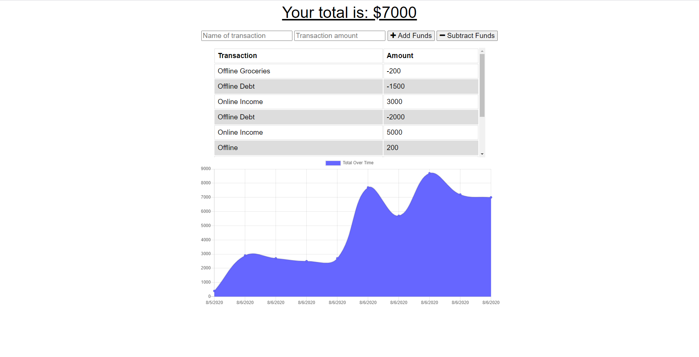

  
# budget-tracker

## Table of Contents 
1. [Description](#description)

2. [Screenshots](#screenshots)

3. [Installation](#installation)

4. [Usage](#usage)

5. [Contributors](#contributors)

6. [Testing](#testing)

7. [Questions](#questions)

    
## Description 
A budget tracker app that allows the user to store data of their funds. The User is able to enter a name and a price point then either add the funds or subtract the funds. The user is also available to use it offline (when installing the PWA).

### URL(s)
[Repository](https://github.com/sornwill/budget-tracker)
|
[Heroku Deployed Link](https://glacial-retreat-13648.herokuapp.com/)
      
## Screenshots

    
## Installation
npm express, npm mongoose, npm compression, npm lite-server, npm morgan
    
## Usage
General Use 
    
## License
MIT 
    
## Contributors
William Sorn 
    
## Testing
n/a 
      
## Questions
Questions? Please send contact me @sornwill or E-mail : sornwilliam@gmail.com
      
